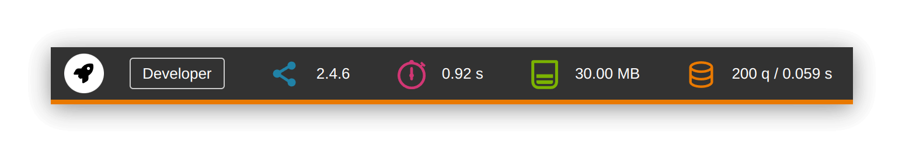

# MGT Developer Toolbar for Magento 2

<p align="center"></p>

## Installation

```
composer require swissup/module-developer-toolbar --dev
bin/magento module:enable Mgt_DeveloperToolbar
bin/magento config:set dev/debug/developer_toolbar 1
```

## Main Features

* Profiler
* Memory Consumption
* List of all Database Queries
* Block nesting
* Cache Storage Information
* Session Storage Information
* Enabled / Disabled Modules
* Request / Response Data
* Handles
* Events / Observers
* Plugins
* Preferences
* PHP-Info

## Differences with [original repo](https://github.com/mgtcommerce/Mgt_Developertoolbar)

* PHP 8.4 compatible
* Magento 2.4.7 compatible
* Improved database page
    * Copy query with a mouse click
    * Similar queries feature helps to find possible n+1 query issues
* Improved profiler page
    * Significant performance improvements
    * Filter entries by time execution
    * Filter entries by entry label
* [Breezefront](https://breezefront.com) compatible
